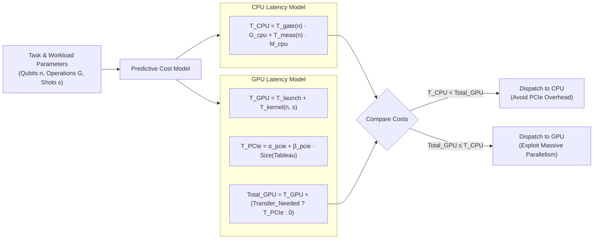
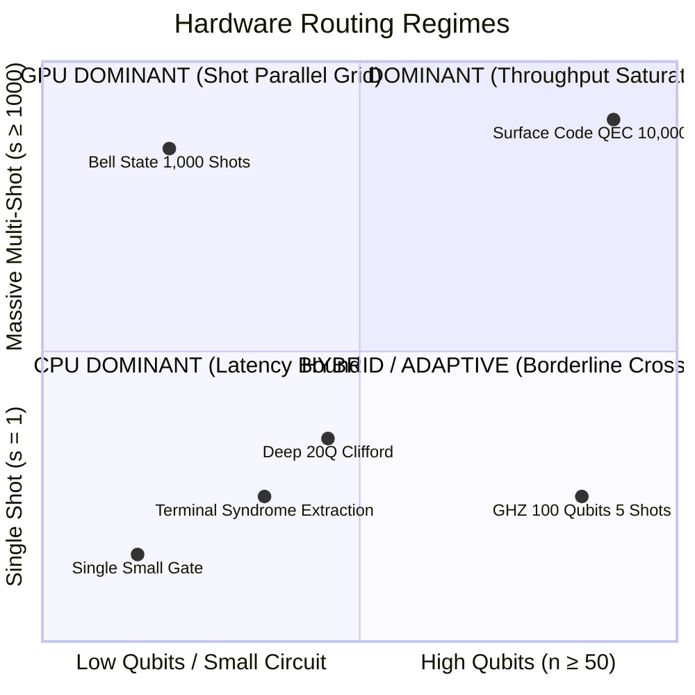
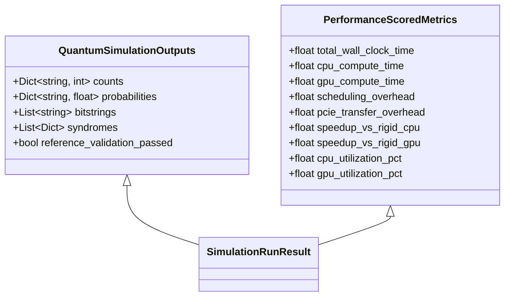

# Adaptive CPU–GPU Runtime Scheduler Architecture & Execution Flow

> **Project Title**: Adaptive CPU–GPU Runtime Scheduling for Stabilizer Quantum Circuit Simulation  
> **Target Architecture**: Phase 4 Dynamic Heterogeneous Execution Engine  
> **Document Purpose**: Complete technical specification and internal execution pipeline diagram.

---

## 1. Executive Answer: "Is this what is happening?"

### The Short Answer:
* **As the Target System Architecture (Phase 4 Vision)**: **YES, EXACTLY.**  
  Your description perfectly captures the design of an adaptive heterogeneous runtime scheduler for quantum simulation. The scheduler acts as an intelligent traffic director that dynamically decomposes circuits, evaluates cost models (compute vs. PCIe transfer costs), dispatches tasks to the lowest-latency device (CPU or GPU), maintains state consistency across host and device memories, and scores the performance against rigid single-device baselines (CPU-only Stim vs. GPU-only QuaSARQ).
* **As the Current Codebase State (Milestone 1 Baseline)**: **NOT YET IN EXECUTION.**  
  Right now, the codebase is at **Milestone 1: Serial CPU Baseline**. The code currently executes strictly sequentially on one CPU core (`simulator/simulator.py`) with zero GPU dispatches and zero PCIe transfers. Milestone 1 was intentionally implemented as a pure serial baseline to profile computational hotspots (`apply_cnot`, `row_mult`), which are required to parameterize the cost models for the scheduler in Phase 4.

---

## 2. Complete High-Level Execution Pipeline

Below is the end-to-end architecture showing circuit ingestion, the dynamic decision engine, memory migration, backend compute, and dual-output reporting (Quantum Outputs + Performance Metrics).

```mermaid
flowchart TD
    subgraph S0["[INPUT STAGE]"]
        IN["Quantum Circuit AST<br/>• Qubit count (n)<br/>• Depth (d)<br/>• Gates & Measurements<br/>• Shots (s)"]
    end

    subgraph S1["[INITIALIZATION & STATIC ANALYSIS]"]
        PARSE["Circuit Feature Extractor<br/>• Measurement Density: ρ_m = M / (G + M)<br/>• Two-Qubit Entanglement Ratio: ρ_2q = CNOT / G<br/>• Batching Regime: s >> 1 vs s = 1"]
        ALLOC["State Allocator<br/>• Primary Stabilizer Tableau: (2n+1) × (2n+1)<br/>• Host/Device Memory Handles<br/>• State Coherence Flags: Location = {CPU, GPU, SHARED}"]
    end

    subgraph S2["[THE ADAPTIVE SCHEDULING RUNTIME LOOP]"]
        direction TB
        TASK_FETCH["Fetch Next Circuit Stage / Batch<br/>(Gate Block, Measurement Layer, or Shot Sub-grid)"]
        
        COST_MODEL{"Runtime Cost Engine<br/>Evaluate Analytical Models:<br/>Cost_CPU(task, n, s)<br/>vs.<br/>Cost_GPU(task, n, s) + Cost_PCIe(Tableau)"}

        DECISION{"Decision Policy<br/>Lowest Total Time?"}

        subgraph PATH_CPU["CPU Backend Branch (Host)"]
            TRANSFER_TO_CPU["State Migration (PCIe Device-to-Host)<br/>*If Tableau Location == GPU*<br/>T_D2H = Latency + (Size / BW_pcie)"]
            EXEC_CPU["CPU Stabilizer Engine<br/>• Cache-localized scalar loops<br/>• AVX2/AVX-512 64-bit SIMD bit-packing<br/>• Low-latency single-measurement resolution<br/>• Pauli frame tracking (Stim-style)"]
        end

        subgraph PATH_GPU["GPU Backend Branch (Device)"]
            TRANSFER_TO_GPU["State Migration (PCIe Host-to-Device)<br/>*If Tableau Location == CPU*<br/>T_H2D = Latency + (Size / BW_pcie)"]
            EXEC_GPU["GPU Stabilizer Engine (QuaSARQ-Style)<br/>• Massive CUDA thread-block grid<br/>• Data-parallel Clifford row updates (2n threads)<br/>• Parallel Gaussian Elimination kernels<br/>• Embarrassingly parallel multi-shot batching"]
        end

        UPDATE_STATE["Update Coherence Manager<br/>• Update Tableau State<br/>• Record Device Location & Dirty Flags<br/>• Log Scheduling Overhead & Execution Timestamps"]
    end

    subgraph S3["[POST-PROCESSING & AGGREGATION]"]
        COLLECT["State & Sample Aggregator<br/>• Concatenate bitstrings from CPU & GPU workers<br/>• Validate parity constraints and syndromic invariants"]
    end

    subgraph S4["[DUAL OUTPUT STAGE]"]
        subgraph OUT_QUANTUM["1. Physical Quantum Outputs"]
            HIST["Measurement Statistics<br/>• Bitstring Histograms (counts)<br/>• Empirical Probability Distributions<br/>• Syndrome Extraction Logs (QEC)"]
        end
        subgraph OUT_PERF["2. Scored Performance Metrics"]
            METRICS["Performance Analytics<br/>• End-to-End Wall Time (T_wall)<br/>• Speedup vs. CPU Baseline (S_cpu = T_cpu / T_wall)<br/>• Speedup vs. GPU Baseline (S_gpu = T_gpu / T_wall)<br/>• Total Scheduling Overhead (δ_sched)<br/>• PCIe Transfer Penalties (T_pcie)<br/>• Device Utilization (U_cpu, U_gpu)"]
        end
    end

    IN --> PARSE --> ALLOC --> TASK_FETCH
    TASK_FETCH --> COST_MODEL --> DECISION
    DECISION -- "CPU Optimal" --> TRANSFER_TO_CPU --> EXEC_CPU --> UPDATE_STATE
    DECISION -- "GPU Optimal" --> TRANSFER_TO_GPU --> EXEC_GPU --> UPDATE_STATE
    UPDATE_STATE -- "More Operations / Shots Remain" --> TASK_FETCH
    UPDATE_STATE -- "All Completed" --> COLLECT
    COLLECT --> OUT_QUANTUM
    COLLECT --> OUT_PERF
```



---

## 3. Deep-Dive: The Scheduling Decision Logic & Cost Model

The core innovation of the adaptive runtime scheduler is the **Cost Engine**. Sending every task blindly to the GPU creates massive slowdowns because transferring data across the PCIe bus incurs significant latency penalties.



### The Mathematical Decision Boundary:
For any task $k$, the scheduler evaluates:

$$\text{Decision}(k) = \operatorname{argmin}_{D \in \{\text{CPU}, \text{GPU}\}} \left( T_{\text{compute}}^D(k) + \mathbb{I}(loc \neq D) \cdot T_{\text{PCIe}}(\text{Tableau}) \right)$$

Where:
* **$T_{\text{compute}}^{\text{CPU}}(k)$**: Scales with $O(n \cdot d)$ for single gates, but is executed instantly with zero kernel launch latency.
* **$T_{\text{compute}}^{\text{GPU}}(k)$**: Scales with $O(\lceil 2n / 1024 \rceil)$ for gates, and scales near-constantly across shots up to the GPU's warp capacity (e.g., 2,048 concurrent shots).
* **$\mathbb{I}(loc \neq D) \cdot T_{\text{PCIe}}$**: The **migration penalty**. The tableau data structure is of size $(2n + 1) \times (2n + 1)$ bits. If the state is already on device $D$, the transfer cost is 0. If it must migrate across PCIe Gen 4, it incurs latency $\alpha \approx 10\,\mu\text{s}$ plus bandwidth transfer time.

---

## 4. Workload Crossover Matrix

The scheduler routes tasks based on where each hardware architecture dominates:



| Workload Characteristic | Optimal Routing | Root Cause |
| :--- | :---: | :--- |
| **Small Qubits ($n \le 10$), Few Shots ($s \le 10$)** | **CPU** | Kernel launch ($T_{\text{launch}} \approx 8\,\mu\text{s}$) and PCIe transfer times exceed the entire execution time on CPU cache. |
| **High Qubits ($n \ge 50$)** | **GPU** | Gate updates involve updating $2n$ rows of $n$ elements ($O(n^2)$). GPU processes thousands of tableau elements simultaneously across CUDA warps. |
| **Large Shot Count ($s \ge 500$)** | **GPU** | Shots are completely independent. GPU launches thousands of threads concurrently (QuaSARQ grid mode), yielding $50\times - 1000\times$ speedups. |
| **Interactive Measurements & Dynamic Feedback** | **CPU** | Deterministic measurement branch resolution with classical feedback loops suffers on GPU due to thread divergence and pipeline stalls. |

---

## 5. Metrics & Scoring Formulation

When a simulation run finishes, the scheduler outputs two distinct categories of data:



### Mathematical Definitions:

1. **Total Wall Time ($T_{\text{wall}}$)**:
   $$T_{\text{wall}} = T_{\text{compute}}^{\text{CPU}} + T_{\text{compute}}^{\text{GPU}} + T_{\text{PCIe}} + \delta_{\text{sched}}$$

2. **Scheduling Overhead ($\delta_{\text{sched}}$)**:
   $$\delta_{\text{sched}} = \sum_{k=1}^K T_{\text{decision}}(k)$$
   *The runtime cost of evaluating the cost model and making routing decisions. A well-designed scheduler must keep $\delta_{\text{sched}} < 2\%$ of $T_{\text{wall}}$.*

3. **Speedup ($S$)**:
   $$S_{\text{CPU}} = \frac{T_{\text{CPU-only baseline}}}{T_{\text{wall}}}, \quad S_{\text{GPU}} = \frac{T_{\text{GPU-only baseline}}}{T_{\text{wall}}}$$
   *The adaptive scheduler is successful when $S_{\text{CPU}} > 1$ and $S_{\text{GPU}} > 1$ across diverse, non-trivial circuits.*

4. **Hardware Utilization ($\mathcal{U}$)**:
   $$\mathcal{U}_{\text{GPU}} = \frac{T_{\text{active GPU kernel}}}{T_{\text{wall}}} \times 100\%, \quad \mathcal{U}_{\text{CPU}} = \frac{T_{\text{active CPU thread}}}{T_{\text{wall}}} \times 100\%$$

---

## 6. Milestone 1 (Current) vs. Phase 4 (Target) Roadmap

```mermaid
gantt
    title HPC Project Implementation Roadmap
    dateFormat  YYYY-MM
    section Completed
    Phase 1 : Serial Baseline (Current)          :done,    p1, 2026-09, 2026-10
    section Upcoming
    Phase 2 : Parallel CPU (OpenMP & SIMD)       :active,  p2, 2026-10, 2026-11
    Phase 3 : GPU Acceleration (QuaSARQ Kernels) :         p3, 2026-11, 2026-12
    Phase 4 : Adaptive CPU-GPU Scheduler         :         p4, 2026-12, 2027-01
```

* **Phase 1 (Active in your repository)**: Pure serial Python/NumPy baseline to find hotspots and calibrate base execution times ($T_{\text{CPU}}$).
* **Phase 2 (Next)**: CPU multithreading and SIMD bit-packing.
* **Phase 3**: QuaSARQ-style CUDA GPU execution on your RTX 5050 GPU ($T_{\text{GPU}}$).
* **Phase 4**: Full dynamic adaptive runtime scheduler implementing the complete flow diagram specified in this document.
